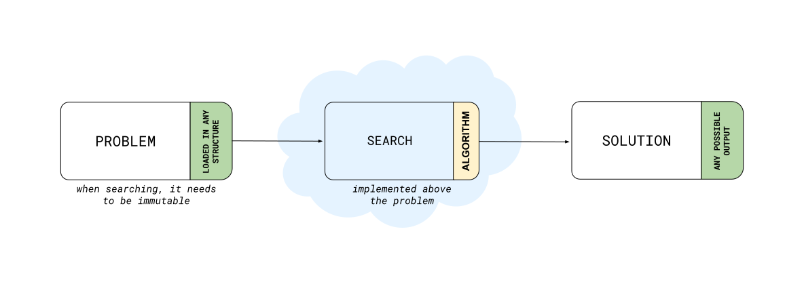

# ai-ufcCourse

##### This is our flow from the beginning (*problem*) to the end (*solution*)
* The *problem* is a Graph that loads some cities of [Romania](https://en.wikipedia.org/wiki/Romania) into the structure, an undirected weighted graph.
* The *search* would be any search algorithm. We're using and testing algorithms from the Artificial Intelligence book cited on the repository description.
* The *solution* is a result-based and expect by the algorithm.

*And, this is our flow.*